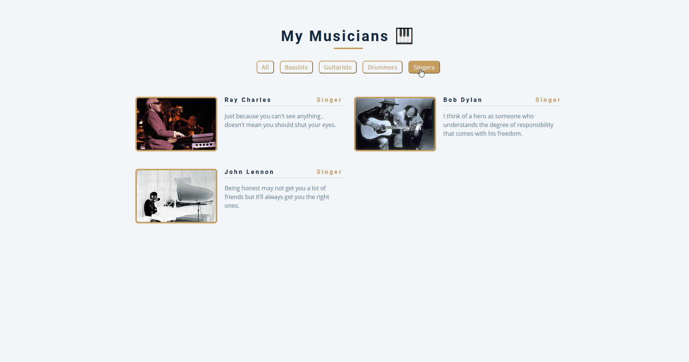

# my-musicians
App to filter and display favourite musicians dinamically - **Live Demo Link** https://mymusicians.netlify.app/

### Rationale for building the app:

I was interested in using map array method to display items dinamically and to create filters in vanilla JavaScript ES6. Also, I love music.

### List of App's Functionality:

- Render items dinamically
- Filters items dinamically

### Instructions for Deploying the App Locally:

- Clone or download the repo
- Open in a text editor the folder
- Open the project folder and open index.html file with a browser
